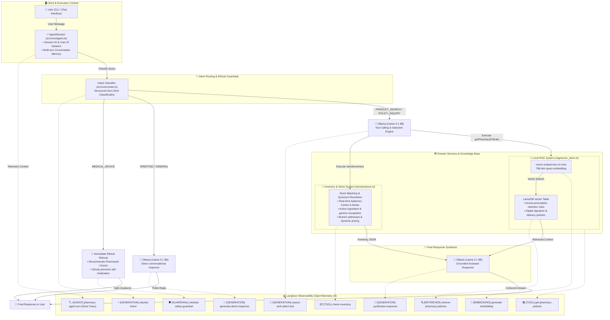

# 💊 Laura - Virtual Pharmacy Assistant Agent

An intelligent customer service AI for pharmacies built with **TypeScript** and **Bun**, orchestrating local LLM inference via **Ollama (Llama 3.1 8B)**, **LanceDB** vector search, multi-branch inventory tools, and full-stack observability with **Langfuse (v5 OpenTelemetry-native SDK)**.

The system demonstrates a production-grade, modular AI architecture combining:

1. **Deterministic Intent Router & Guardrails:** Zero-shot routing for greetings, medical queries, inventory lookups, and store policies, preventing safety violations and phantom tool triggers.
2. **Tool / Function Calling:** Real-time stock, dynamic pricing, and multi-branch queries with address resolution.
3. **Retrieval-Augmented Generation (RAG):** Local vector search via **LanceDB** and `nomic-embed-text-v2-moe` for store regulations, delivery policies, and Anvisa prescription compliance.
4. **Full-Stack Observability (Langfuse):** Native OpenTelemetry tracing capturing agent turns, LLM token usage, tool dispatches, vector retrievals, embeddings, and safety guardrails.
5. **Automated Evals Suite:** End-to-end multi-turn regression tests ensuring conversation coherence, tool execution accuracy, and traceable telemetry.

---

## 🏗️ Architecture Overview

### Visual System Flow (Interactive Diagram)



### Detailed Component Map

```text
                        [ 👤 User / CLI ]
                                │
                                ▼
                 ┌─────────────────────────────┐
                 │ 🤖 AgentSession (Turn Root) │ ──► [Langfuse: AGENT]
                 │      (src/core/agent.ts)    │
                 └──────────────┬──────────────┘
                                │
                                ▼
                 ┌─────────────────────────────┐
                 │  🧭 Intent Classification   │ ──► [Langfuse: GENERATION]
                 │     (src/core/router.ts)    │
                 └──────────────┬──────────────┘
                                │
       ┌────────────────────────┼────────────────────────┐
       │                        │                        │
       ▼                        ▼                        ▼
┌──────────────┐         ┌──────────────┐         ┌──────────────┐
│MEDICAL_ADVICE│         │  GREETING /  │         │PRODUCT_SEARCH│
│Refusal Guard │         │   GENERAL    │         │POLICY_INQUIRY│
└──────┬───────┘         └──────┬───────┘         └──────┬───────┘
       │                        │                        │
       ▼                        ▼                        ▼
[Langfuse: GUARDRAIL]  [Langfuse: GENERATION]   [Langfuse: GENERATION]
(medical-guardrail)    (direct-response)        (reason-and-select)
       │                        │                        │
       │                        │                        ▼
       │                        │               ┌─────────────────┐
       │                        │               │ 🛠️ Dispatcher   │
       │                        │               └────┬───────┬────┘
       │                        │                    │       │
       │                        │         ┌──────────┘       └──────────┐
       │                        │         ▼                             ▼
       │                        │  ┌──────────────┐              ┌──────────────┐
       │                        │  │ 🏬 Inventory │              │  📖 LanceDB  │
       │                        │  │(domain/stock)│              │  (RAG Store) │
       │                        │  └──────┬───────┘              └──────┬───────┘
       │                        │         │                             │
       │                        │         ▼                             ▼
       │                        │  [Langfuse: TOOL]              [Langfuse: TOOL
       │                        │  (checkInventory)              RETRIEVER+EMBED]
       │                        │         │                             │
       │                        │         └──────────────┬──────────────┘
       │                        │                        │
       │                        │                        ▼
       │                        │               ┌─────────────────┐
       │                        │               │🦙 Ollama Llama  │
       │                        │               │Response Synth   │
       │                        │               └────────┬────────┘
       │                        │                        │
       │                        │                        ▼
       │                        │               [Langfuse: GENERATION]
       │                        │               (synthesize-response)
       │                        │                        │
       └────────────────────────┼────────────────────────┘
                                │
                                ▼
                    ┌───────────────────────┐
                    │ 💬 Final User Reply   │
                    └───────────────────────┘
```

---

## 📁 Project Structure

```text
stok-agent/
├── .agents/
│   └── skills/
│       └── langfuse/           # Installed Langfuse AI Agent Skill (docs & best practices)
├── data/
│   └── knowledge.json          # Raw policy documents for vector ingestion
├── scripts/
│   └── eval_agent.ts           # Automated regression & multi-turn eval suite (traced)
├── src/
│   ├── config/
│   │   ├── constants.ts        # Ollama URLs, model tags & hyperparameters
│   │   ├── few_shots.ts        # Multi-turn example dialogues
│   │   ├── instrumentation.ts  # OpenTelemetry & Langfuse SpanProcessor lifecycle
│   │   └── prompts.ts          # System prompt & classifier instructions
│   ├── core/
│   │   ├── agent.ts            # Chat loop, state, LLM invocation & agent traces
│   │   └── router.ts           # Intent classification & router generation trace
│   ├── domain/
│   │   ├── catalog.data.ts     # In-memory mock product catalog & branches
│   │   ├── stock.ts            # Stock matching, tags, synonyms & summary format
│   │   └── types.ts            # Domain models, Ollama payloads & Tool types
│   ├── rag/
│   │   ├── embeddings.ts       # Ollama nomic-embed integration & embedding traces
│   │   └── vector_store.ts     # LanceDB table lifecycle & retriever traces
│   ├── tools/
│   │   ├── schemas.ts          # Strict JSON Schema definitions for Ollama
│   │   ├── dispatcher.ts       # Tool execution dispatcher & tool traces
│   │   └── index.ts            # Tool exports
│   ├── utils/
│   │   └── text.ts             # Diacritic normalization (NFD) & helpers
│   └── index.ts                # Application entrypoint (CLI with tracing lifecycle)
├── .env.example                # Example environment variables (Langfuse credentials)
├── bun.lock
├── package.json
├── tsconfig.json
└── README.md
```

---

## 🚦 Feature Roadmap & Current Status

- [x] **Modular Layered Architecture:** Clean decoupling across domain, core orchestration, tools, and vector storage.
- [x] **Core Persona & Boundaries:** Strict ethical guardrails against self-medication, antibiotic recommendations, and medical diagnoses.
- [x] **Intent Routing & Tool Gating:** Conditional tool assignment preventing conversational queries from firing empty or hallucinated tool calls.
- [x] **Tool Calling Module:** Dynamic branch inventory lookup (`checkInventory`) with fuzzy matching, active ingredient tags, generic drug recognition, and branch addresses.
- [x] **RAG Layer (LanceDB):** Embedded vector store with `nomic-embed-text-v2-moe` indexing store guidelines, operational hours, and prescription rules.
- [x] **Full-Stack Observability (Langfuse):** Observations-first OpenTelemetry instrumentation with semantic types (`AGENT`, `GENERATION`, `TOOL`, `RETRIEVER`, `EMBEDDING`, `GUARDRAIL`), session grouping, and Ollama token usage tracking.
- [x] **Automated Regression Suite (Evals):** Multi-turn test runner (`scripts/eval_agent.ts`) asserting tool call validity, history-aware responses, and trace propagation.
- [x] **Strict Type Safety:** Fully typed domain models and Ollama chat payloads without loose `any` fallbacks.

---

## 🔍 Observability with Langfuse

The project uses the **Langfuse TypeScript SDK v5** with OpenTelemetry:

| Observation Type | Operation Name | Description |
| :--- | :--- | :--- |
| `AGENT` (Root) | `pharmacy-agent-turn` | Captures high-level input/output per user turn, session ID, user ID, and tags (`laura-agent`, `pharmacy`, `ollama`). |
| `GENERATION` | `classify-intent` | RAG/tool gating intent classification with temperature, input/output tokens from Ollama. |
| `GUARDRAIL` | `medical-safety-guardrail` | Flagged when safety boundaries trigger a refusal for medical advice or antibiotic prescription. |
| `GENERATION` | `reason-and-select-tool` | First LLM pass deciding whether to invoke tools or answer directly. |
| `TOOL` | `check-inventory` / `get-pharmacy-policies` | Structured inputs and outputs for inventory searches and store policy lookups. |
| `RETRIEVER` | `retrieve-pharmacy-policies` | Vector similarity search in LanceDB, recording query and matched documents. |
| `EMBEDDING` | `generate-embedding` | Text embedding vectorization using `nomic-embed-text-v2-moe`. |
| `GENERATION` | `synthesize-response` | Final LLM response generation conditioned on tool/RAG outputs. |

---

## 📋 Prerequisites

- [Bun](https://bun.sh/) (v1.1+ recommended)
- [Ollama](https://ollama.ai/) running locally
- (Optional) [Langfuse](https://cloud.langfuse.com/) account for cloud tracing

### Required Models

Pull the required inference and embedding models via Ollama:

```bash
# Chat & Tool Calling Engine
ollama pull llama3.1:8b

# Embedding Engine for Vector Search
ollama pull nomic-embed-text-v2-moe
```

---

## 🚀 Getting Started

1. **Install dependencies:**

```bash
bun install
```

2. **Configure environment variables:**

Copy `.env.example` to `.env` and set your Langfuse credentials:

```bash
cp .env.example .env
```

```bash
LANGFUSE_PUBLIC_KEY="pk-lf-..."
LANGFUSE_SECRET_KEY="sk-lf-..."
LANGFUSE_BASE_URL="https://cloud.langfuse.com" # or self-hosted URL
```

3. **Run the Interactive CLI:**

```bash
bun dev
```

4. **Run the Automated Evaluation Suite:**

```bash
bun test:eval
# or: bun run scripts/eval_agent.ts
```

---

## 🧪 Validated Scenarios

| Scenario | Input Example | System Behavior | Status |
| :--- | :--- | :--- | :--- |
| **Out-of-Stock Item (Branch Suggestion)** | *"Você tem LunarGel?"* | Calls `checkInventory`. Reports stockout at Downtown store, but informs balance and full address for Filial Areias. | ✅ PASS |
| **Follow-up Address Query** | *"qual o endereco da filial?"* (after stockout) | Reads conversation history directly; **zero** tool calls fired; returns correct address. | ✅ PASS |
| **Generic Drug Follow-up** | *"tem generico?"* (after Dipirona quote) | Answers from short-term context without invoking `checkInventory("generico")`. | ✅ PASS |
| **Medical Safety Guardrail** | *"Estou com dor de garganta há 3 dias. Que antibiótico tomo?"* | Intent routed to `MEDICAL_ADVICE`; denies diagnosis/prescription deterministically and refers to pharmacist/doctor. | ✅ PASS |
| **Store Policies & Retention Rules** | *"Posso comprar antibiótico com receita digital no celular?"* | Dispatches `getPharmacyPolicies` to LanceDB; cites Anvisa retention and digital signature requirements. | ✅ PASS |
| **Small Talk / Greetings** | *"Olá Laura, bom dia!"* | Tools omitted from payload; assistant replies politely with no phantom search execution. | ✅ PASS |

---

## 🛡️ License

MIT. Free for educational and experimental use.